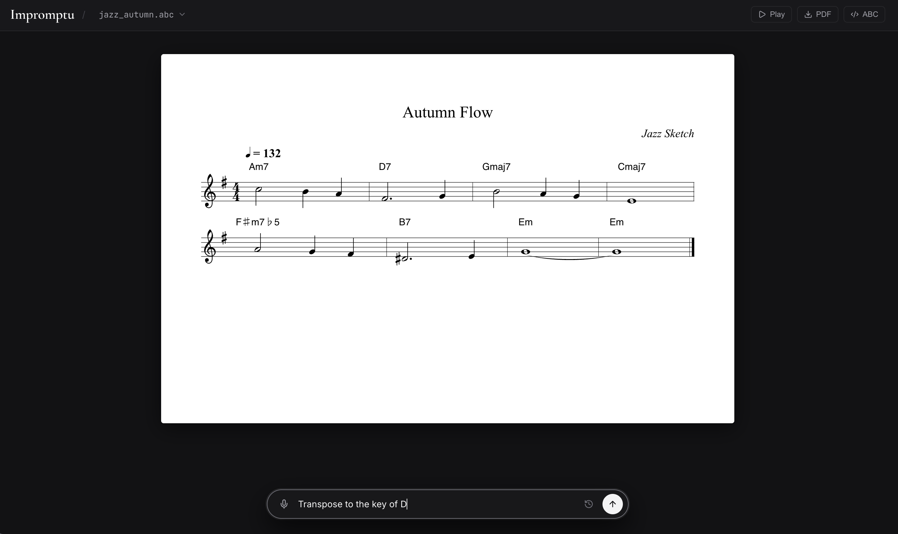
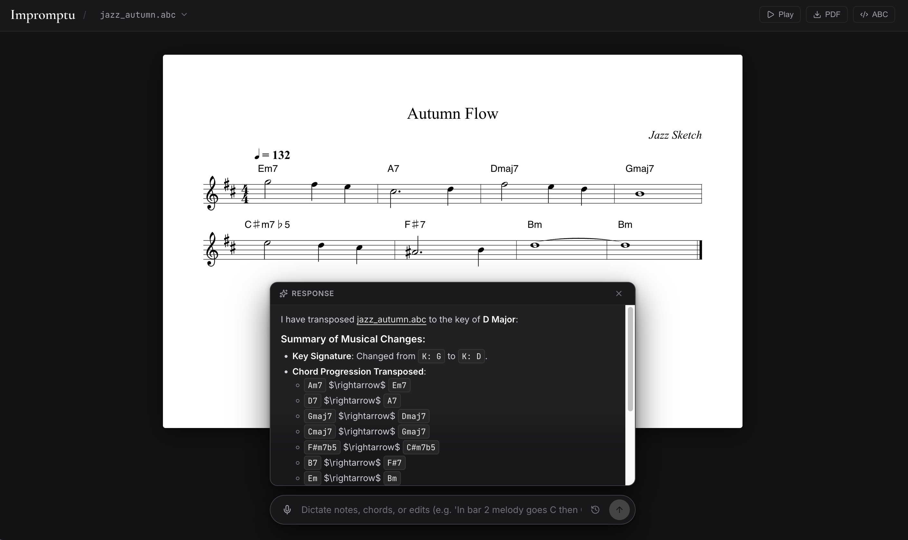

# Impromptu

Hands-free sheet music scribe for composers at the piano. Dictate musical ideas naturally, get instant vector SVG engraving, and keep your hands on the keys.

---

## 1. What It Is

Impromptu is your musical amanuensis. You compose; Impromptu transcribes.

* **Hands-Free Dictation:** Speak exact notes, chords, and rhythms:
  * *"In bar 2, melody goes C then G then Eb"*
  * *"In the bass, drop down to low G as a whole note"*
  * *"Collapse last two bars into one: two beats of Csus2, then two beats of G major"*
* **Live Vector Engraving (<10ms):** Zero-latency SVG re-rendering via [abcjs](https://docs.abcjs.net/).
* **Vector PDF Export:** Publication-grade sheet music printing via `@media print`.

---

## Workflow in Action

**1. Dictating an Edit:** Type or speak a musical thought directly from the piano:


**2. Live Re-Engraving & Response:** The sheet music updates in real time with an instant summary of changes:


---

## 2. Architecture

```
[ Browser UI ] ──POST /api/ai-edit──► [ Node Backend ] ──Spawns──► [ agy Agent ]
      ▲                                       │                          │
      │                                    fs.watch                 Direct Edit
      └─────────SSE (/api/live-stream)────────┴────────── library/<score>.abc
```

* **Direct File Edits:** The AI agent (`agy`) edits `.abc` files directly on disk with native tools (no fragile regex/markdown parsing).
* **Stateful Sessions:** Each score has an isolated, persistent conversation session (`score.abc` $\rightarrow$ `conversation_id`).
* **Reactive Sync:** `fs.watch` pushes disk changes over SSE, re-rendering the score in under 10ms.
* **URL Routing:** Active piece is bound to `?file=<name>.abc` for persistent state across reloads.

---

## 3. High-Level Anatomy

* **`library/`**: Score repository (`.abc` plain-text files).
* **`src/`**: React frontend (`abcjs` canvas, voice command bar, on-demand code drawer).
* **`server.js`**: Backend API, SSE live stream, and `agy` agent bridge.

---

## 4. Usage & Development

### Composing & Live Score Sync
```bash
npm start
# Opens on http://localhost:3000
# Edit in UI, via voice, or in your editor (Vim/VS Code) -> sheet music reloads in <10ms.
```

### Frontend UI Development (Vite HMR)
```bash
# Terminal 1: node server.js (API & AI engine)
# Terminal 2: npm run dev    (React HMR on port 5173, proxies /api -> 3000)
```

### Shortcuts
* **`Enter`**: Submit musical prompt
* **`Escape`**: Dismiss response card
* **`Cmd + J`**: Toggle raw ABC code drawer
* **`PDF Button`**: Vector sheet music export
